## 251211

### [Objectives_ 학습 목표]
- DRF에 로그인 요청 후 Pinia store에 인증 토큰을 저장함
- Pinia store의 토큰을 Authorization 헤더에 담아 요청함
- store의 토큰 유무에 따라 computed로 로그인 상태를 관리함
- Navigation Guard를 사용해 인증 여부에 따라 접근을 제어함
- dj-rest-auth의 회원가입 Serializer를 커스터마이징함
- Vue에서 회원가입 form을 만들고 DRF 서버에 데이터를 전송함
- 로그아웃 요청 후 store의 토큰 정보를 삭제할 수 있음
---
### [Build_ 이론]
### 인증 with Vue
**사전 준비**
- DB 초기화 : db.sqlite3 삭제
- Migration 과정 재진행
- 관리자 계정 생성 후, 게시글 1개 이상 작성
  - 기존 fixtures 데이터는 user 정보가 없으므로 사용 불가능

**시작하기 전에**
- 정상 작동하던 게시글 전체 조회가 작동하지 않음
  - 401 status code 확인
- 게시글 조회 요청 시 인증에 필요한 수단(token)을 보내지 않고 있으므로 게시글 조회가 불가능해진 것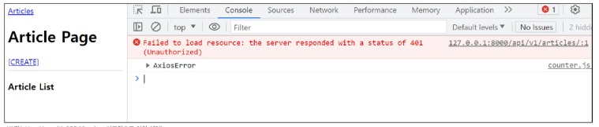
- 회원 가입/로그인 과정에서 token을 발급받아 store에 저장
- 인증이 필요한 요청마다 token을 함께 보내는 과정을 진행
- 401 오류가 해결되고 게시글이 정상적으로 출력되는 모습을 확인하는 것이 목표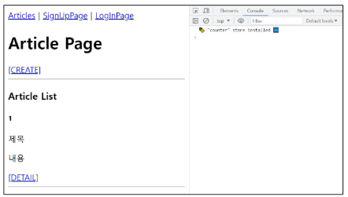

### 회원가입
**회원가입 로직 구현**
- SignUpView route 관련 코드 주석 해제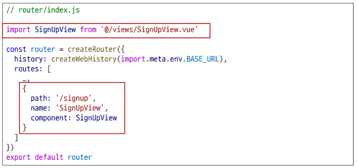
- App 컴포넌트에 SignUpView 컴포넌트로 이동하는 RouterLink 작성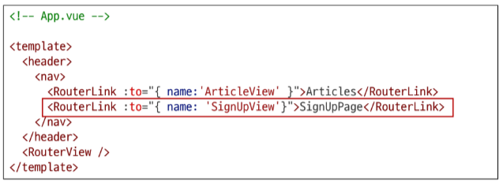
- 회원가입 form 작성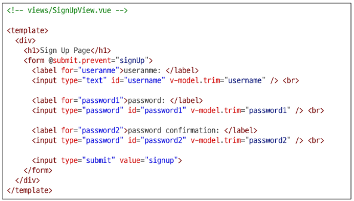
- 사용자 입력 데이터와 바인딩 될 반응형 변수 작성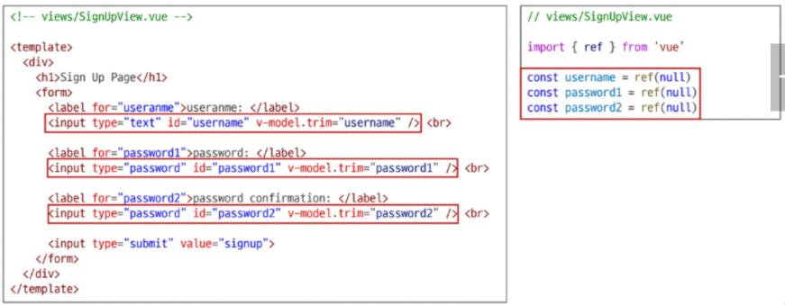
- SignUpView 컴포넌트 출력 확인
  - http://localhost:5173/signup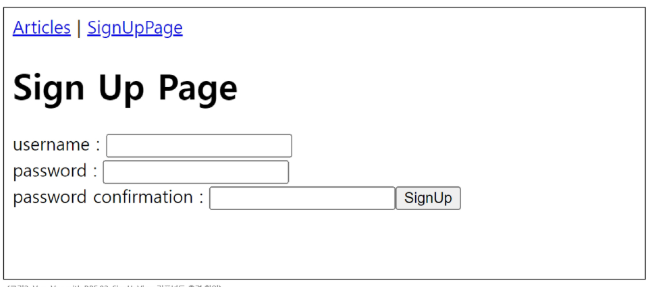
- 회원가입 요청을 보내기 위한 signUp 함수가 해야할 일
  - 사용자 입력 데이터를 받아
  - 서버로 회원가입 요청을 보냄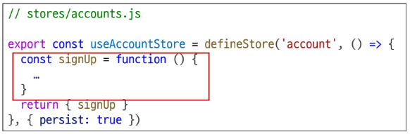
- 컴포넌트에 사용자 입력 페이지를 저장 후 store의 signUp 함수를 호출하는 함수 작성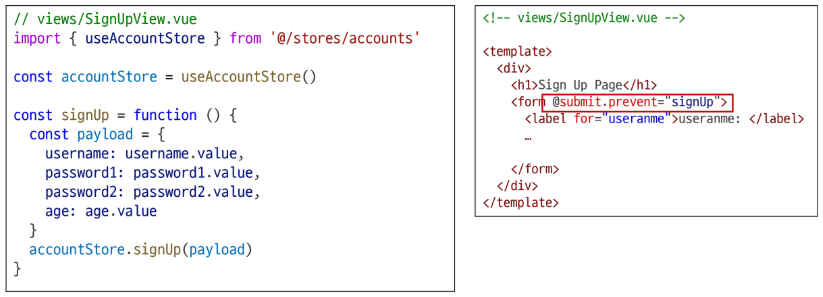
- 실제 회원가입 요청을 보내는 store의 signUp 함수 작성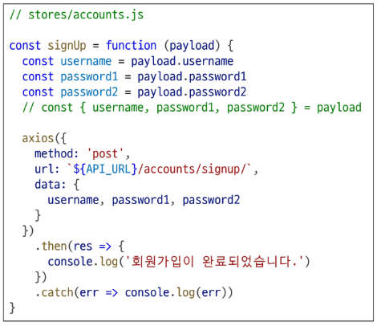
- 회원가입 테스트 후 Django DB 확인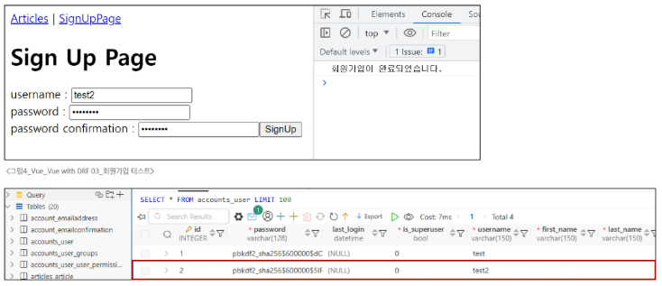

### 로그인
**로그인 로직 구현**
- LogInView route 관련 코드 주석 해제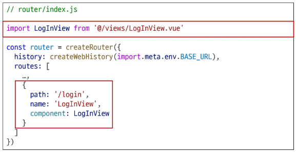
- App 컴포넌트에 LogInView 컴포넌트로 이동하는 RouterLink 작성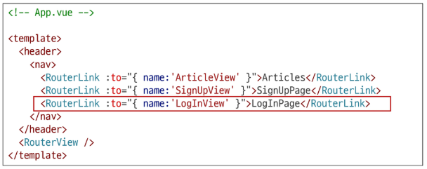
- 로그인 form 작성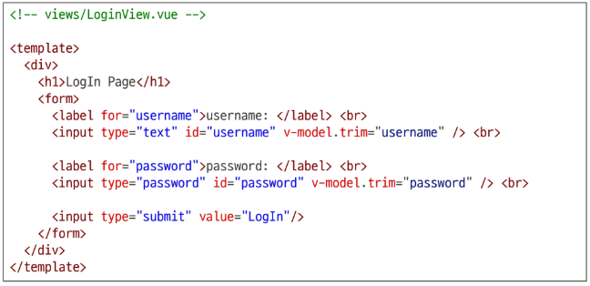
- 사용자 입력 데이터와 바인딩 될 반응형 변수 작성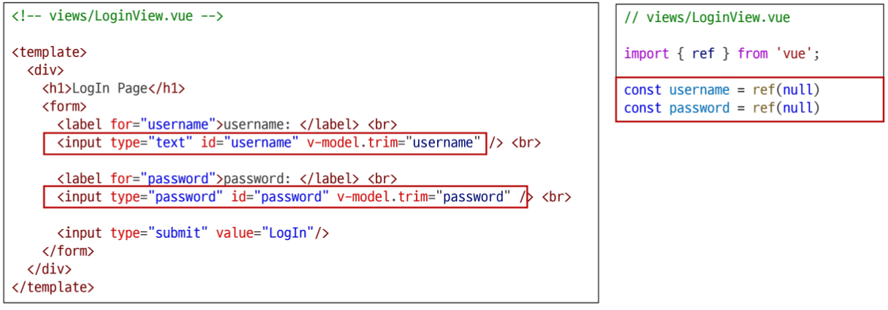
- LogInView 컴포넌트 확인
  - http://localhost:5173/login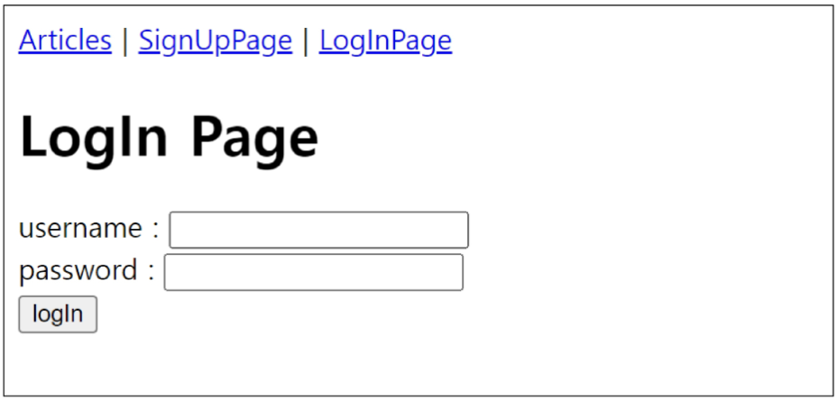
- 로그인 요청을 보내기 위한 logIn 함수가 해야할 일
  - 사용자 입력 데이터를 받아
  - 서버로 로그인 요청 및 응답 받은 토큰 저장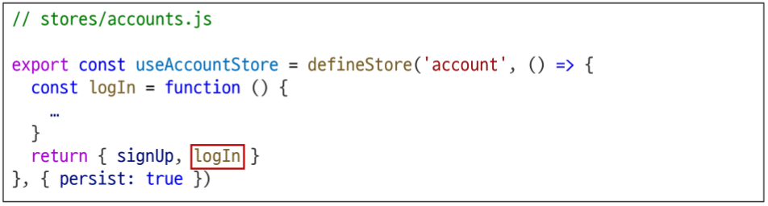
- 컴포넌트에 사용자 입력 데이터를 저장 후 store의 logIn 함수를 호출하는 함수 작성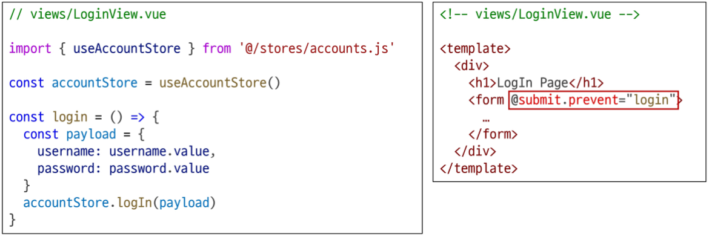
- 실제 로그인 요청을 보내는 store의 logIn 함수 작성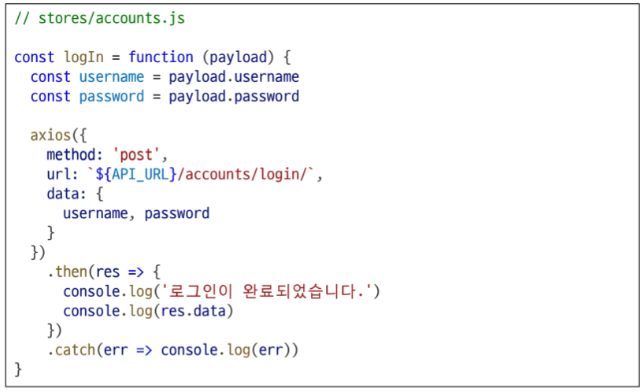
- 로그인 후 응답 객체 안에 Django가 발급한 Token이 함께 온 것을 확인 -> 이제 Token을 store에 저장하여 인증이 필요한 요청마다 함께 보내기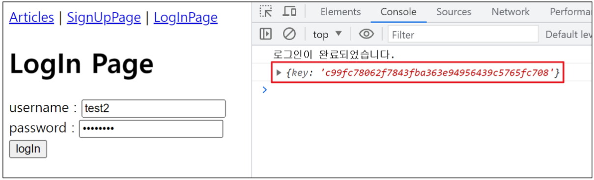

### 요청과 토큰
**토큰 저장 로직 구현**
- 반응형 변수 token 선언 및 토큰 저장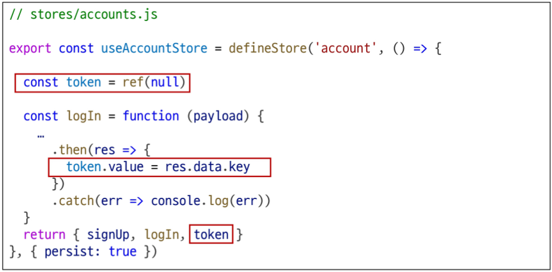
- 다시 로그인 요청 후 store에 저장된 토큰 확인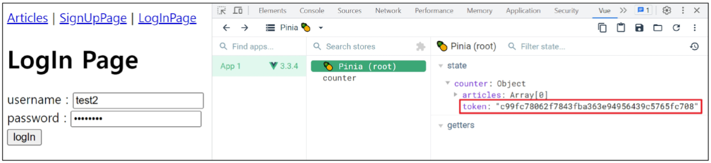

**게시글 전체 목록 조회 with token**
- 게시글 전체 목록 조회 요청 함수(getArticles)에 token 추가 후 게시글 전체 목록 조회하기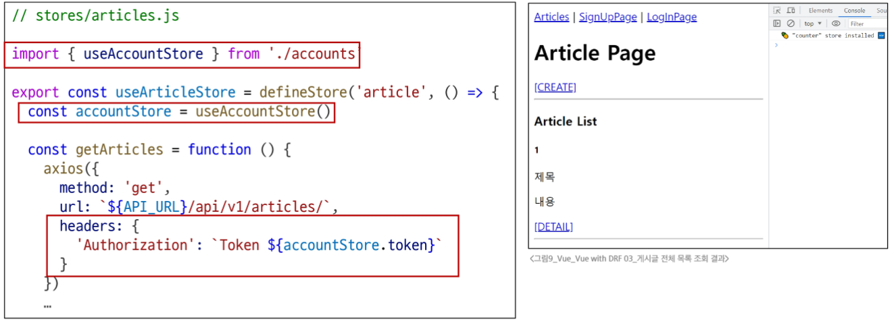
- 게시글 생성 요청 함수(createArticle)에 token 추가 후 게시글 생성하기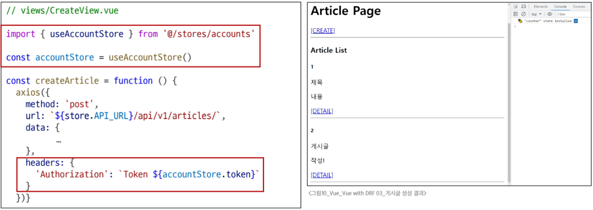

### 인증 여부 확인
**사용자의 인증(로그인) 여부에 따른 추가 기능 구현**
1. 인증되지 않은 사용자

    -> 메인 페이지 접근 제한
2. 인증된 사용자

    -> 회원가입 및 로그인 페이지에 접근 제한

**인증 상태 여부를 나타낼 속성 값 지정**
- token 소유 여부에 따라 로그인 상태를 나타낼 isLogin 변수 작성
- computed를 활용해 token 값이 변경될 때만 이 상태를 다시 계산하도록 함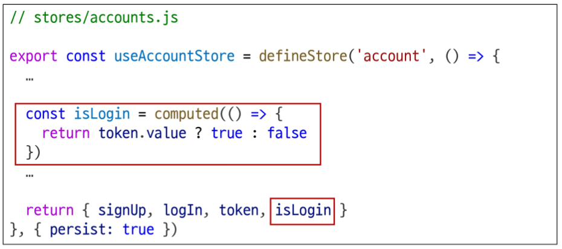

**인증되지 않은 사용자는 메인 페이지 접근 제한**
- 전역 네비게이션 가드 beforeEach를 활용하여, 인증되지 않은 사용자가 보호된 페이지(ex : 메인 페이지)로 이동하려 할 때 로그인 페이지로 리다이렉트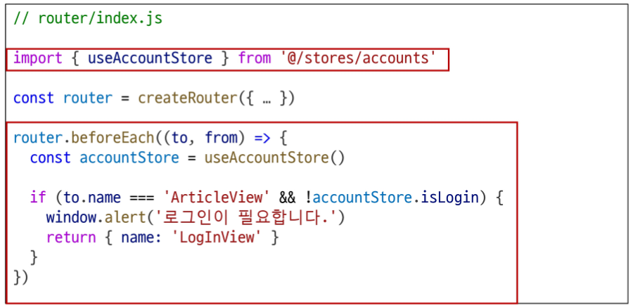
- 브라우저 local storage에서 token을 삭제 후 메인 페이지 접속 시도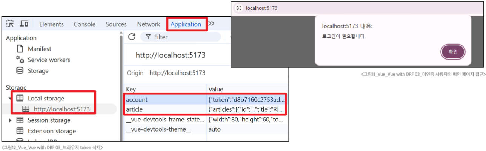

**인증된 사용자는 회원가입과 로그읜 페이지에 접근 제한**
- 다른 주소에서 회원가입 또는 로그인 페이지로 이동 시 이미 인증된 사용자라면 메인 페이지로 이동시키기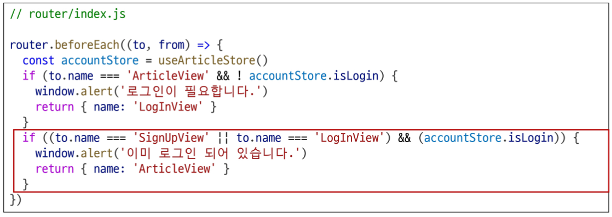
- 로그인 후 회원가입, 로그인 페이지 접속 시도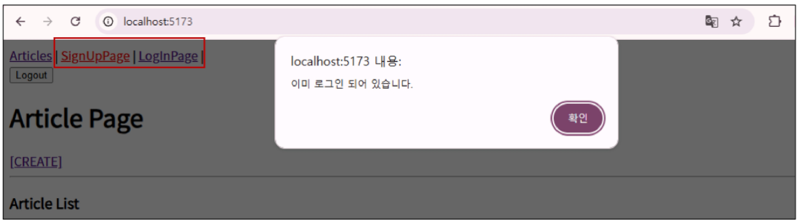

### User Customize
**사전 준비**
- DB 초기화 : db.sqlite3 삭제

**User Model에 필드 추가**
- 사용자의 나이 정보를 저장할 PositiveIntegerField 추가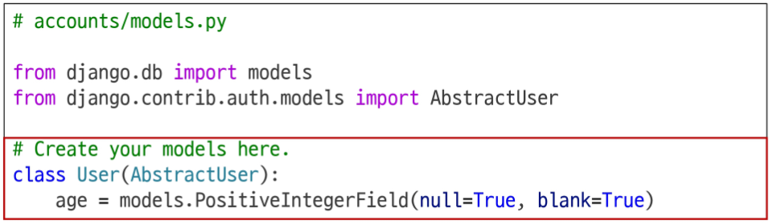
- makemigrations, migrate 작업 진행
- age 필드 추가 확인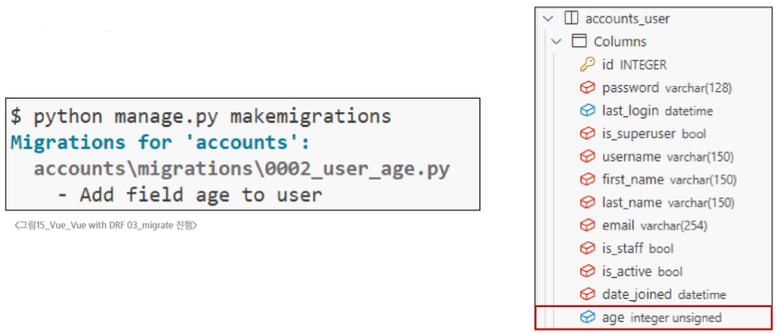

**Vue 회원가입 기능 수정**
- age 입력을 위한 input과 변수 및 payload data 수정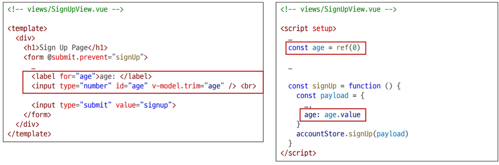
- signUp 함수에 age 정보 추가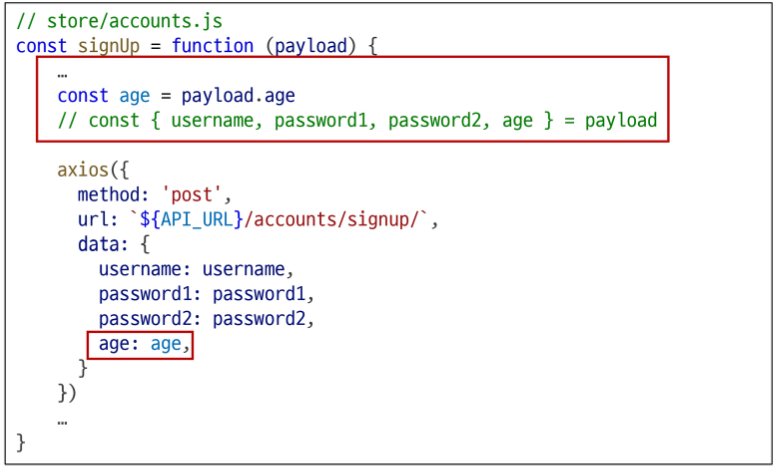

**회원가입 성공?**
- 회원가입 요청 후, 응답 결과 확인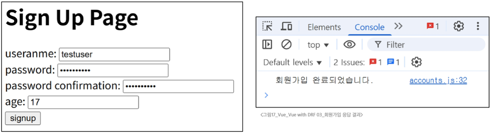
- 요청 보낸 유저 명으로 잘 생성되었으나, age 정보 누락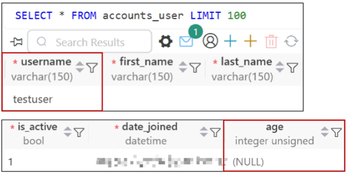

**RegisterSerializer**
- dj-rest-auth의 RegisterSerializer의 field 정보 확인
- username, email, password1, password2 필드만 정의되어 있음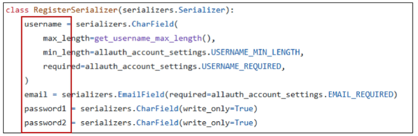

**Customize RegisterSerializer**
- 회원 가입 기능 수정
  - CustomRegisterSerializer에 정의(RegisterSerializer 상속)
  - age 필드 추가(필요하다면, first_name 등 기본 제공 필드 추가 가능)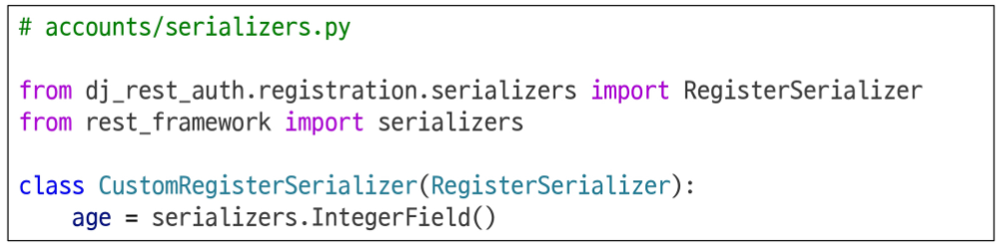
  - 유효성 검사를 위한 get_cleaned_data 함수 구조 확인
  - 입력 받은 데이터의 유효성 검사 결과를 객체 형태로 반환해야 함
  - 새롭게 추가한 필드도 추가하여 동일하게 동작할 수 있도록 수정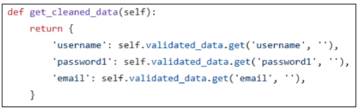
  - super()를 사용하여, 기존 필드에 대한 유효성 검사 실행 후, 추가 필드에 대해 동일한 작업을 진행한 결과를 반영하여 반환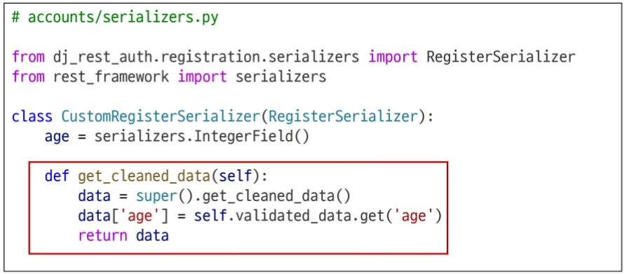
  - save 함수도 유효성 검사 함수와 같은 작업을 진행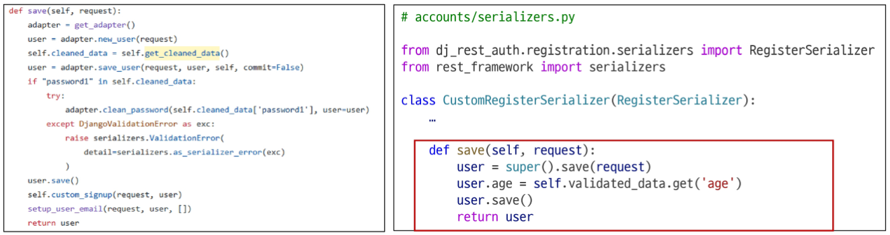
  - dj-rest-auth가 CustomRegisterSerializer을 사용하도록 settings.py에 설정
  - REST_AUTH_REGISTER_SERIALIZERS 주석 해제

- 회원 가입 요청 및 결과 확인
  - 이전과 달리 정상적으로 age 정보가 기입됨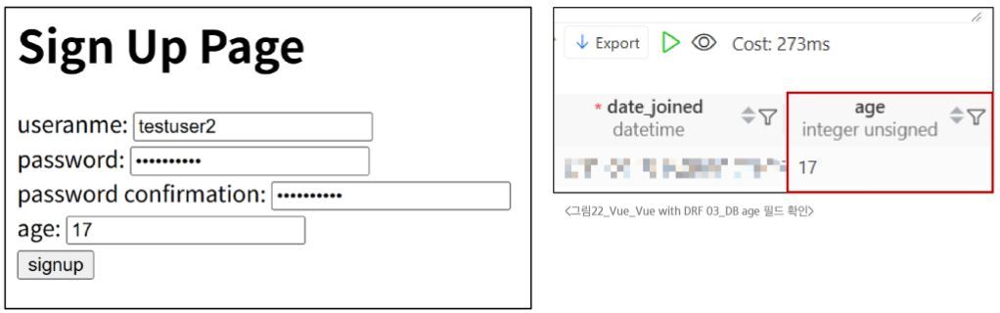

### 참고
**로그아웃 구현**
- logOut 작성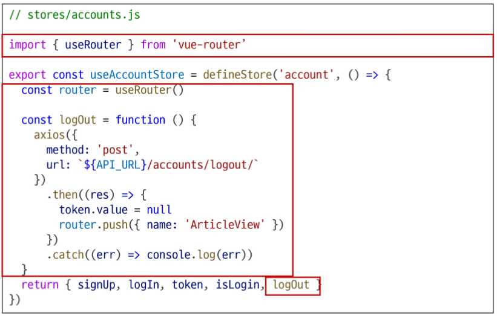
- App 컴포넌트에 로그아웃 form 요소 작성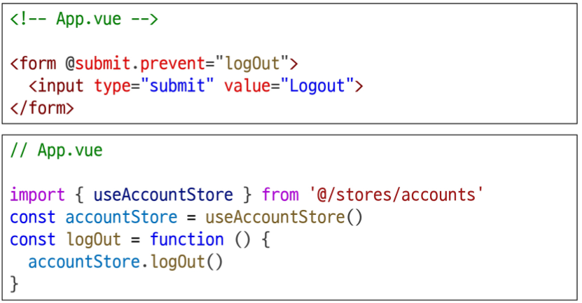

**로그인 성공 후 자동으로 메인 페이지로 이동하기**
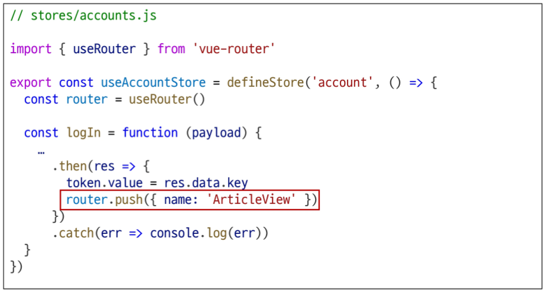

**회원가입 성공 후 자동으로 로그인까지 진행하기**
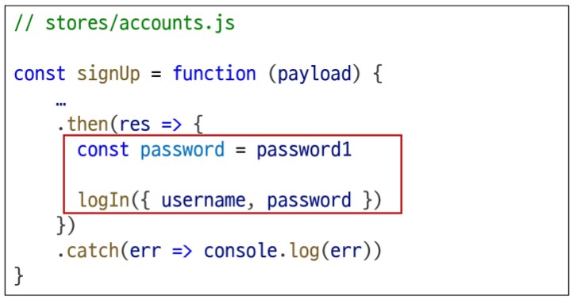

**Django Signals**
- "이벤트 알림 시스템"
- 애플리케이션 내에서 특정 이벤트가 발생할 때, 다른 부분에 신호를 보내어 이벤트가 발생했음을 알릴 수 있음
- 주로 모델의 데이터 변경 또는 저장, 삭제와 같은 작업에 반응하여 추가적인 로직을 실행하고자 할 때 사용
  - 사용자가 새로운 게시글을 작성할 때마다 특정 작업(ex : 이메일 알림 보내기)을 수행하려는 경우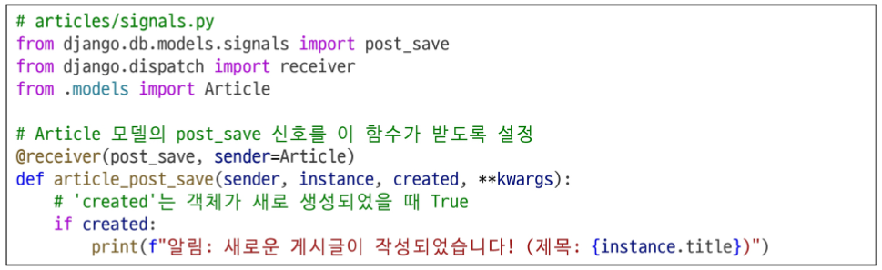

**환경 변수(environment variable)**
- 애플리케이션의 설정이나 동작을 제어하기 위해 사용되는 변수
- 개발, 테스트 및 프로덕션 환경에서 다르게 설정되어야 하는 설정 값이나 민감한 정보(ex. API key)를 포함
- 환경 변수를 사용하여 애플리케이션의 설정을 관리하면, 다양한 환경에서 일관된 동작을 유지하면서 필요에 따라 변수를 쉽게 변경할 수 있음
- 보안적인 이슈를 피하고, 애플리케이션을 다양한 환경에 대응하기 쉽게 만들어 줌

**Vite에서 환경 변수를 사용하는 법**
- .env.local 파일 생성 및 API 변수 작성
- 주의사항
  - 변수명은 반드시 VITE_ 접두어를 작성
  - 변수명과 값 사이에 공백이 없어야 함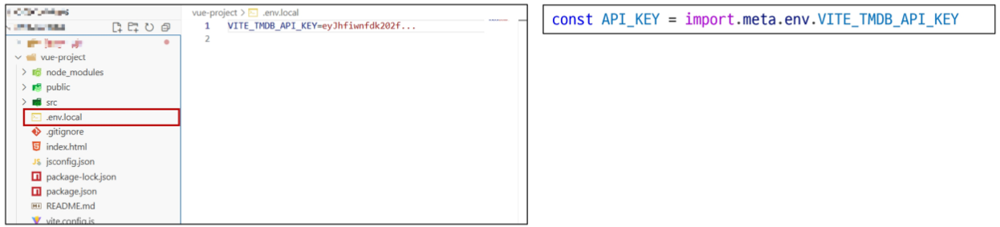

**Vue 참고 자료**
- Awesome Vue.js
    
    : Vue와 관련하여 엄선된 유요한 자료를 아카이빙 및 관리하는 프로젝트
    - https://github.com/vuejs/awesome-vue
    - https://awesome-vue.js.org/
- Vuetify

    : Vue를 위한 UI 라이브러리(ex. 'Bootstrap')
    - https://vuetifyjs.com/en/

**설치한 라이브러리 정리**
- pinia-plugin-oersistedstate

    : Pinia의 상태를 브라우저의 localStorage에 자동으로 저장해주는 플러그인
- axios

    : Vue가 Django 서버와 데이터를 주고받기 위해 사용하는 HTTP 통신 라이브러리
- djangorestframework

    : Django로 REST API를 구축하기 위한 핵심 프레임워크
- django-cors-headers

    : CORS(교차 출처 리소스 공유) 헤더를 처리해주는 라이브러리
- dj-rest-auth

    : Django의 기본 인증 시스템을 기반으로 로그인, 로그아웃, 비밀번호 변경 등의 기능을 API 엔드포인트로 제공
- dj-rest-auth[with-social]

    : 기본 dj-rest-auth 기능에 더해 API를 구현하는 데 필요한 django-allauth 라이브러리를 함께 설치
  
---
### [Review_ 활동 정리]
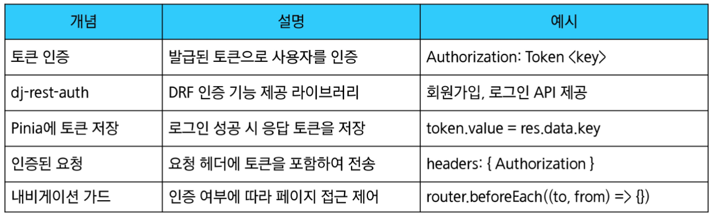
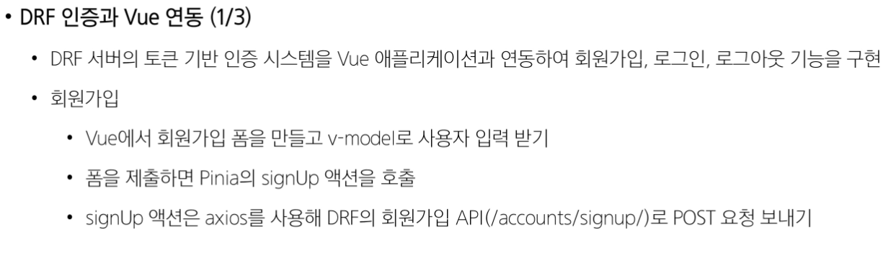
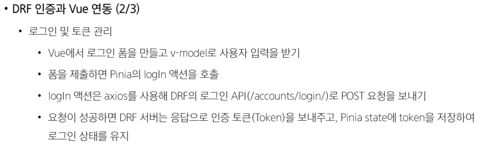
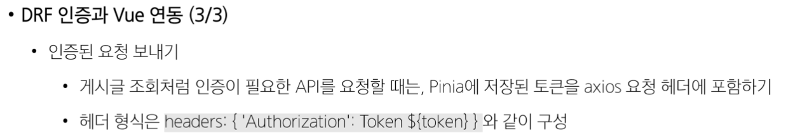
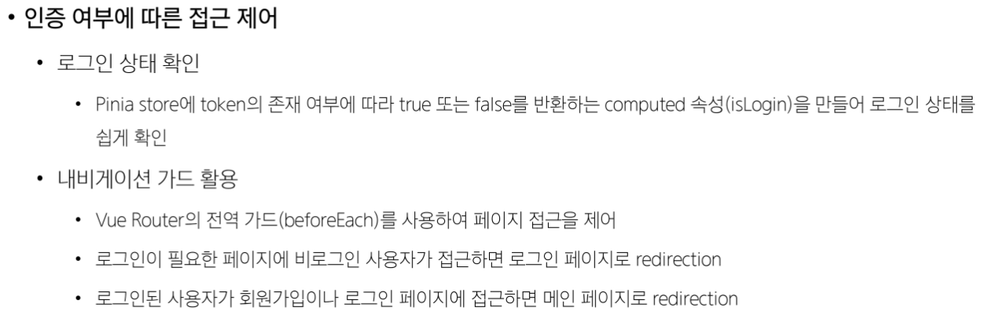
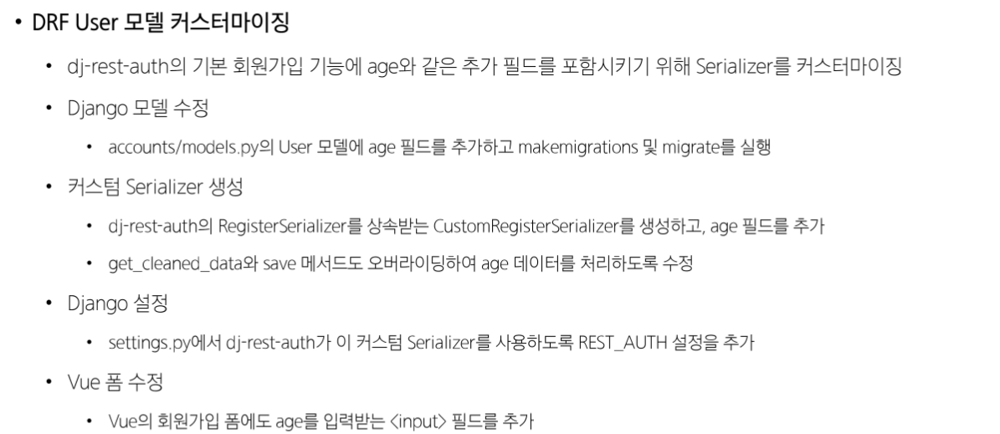
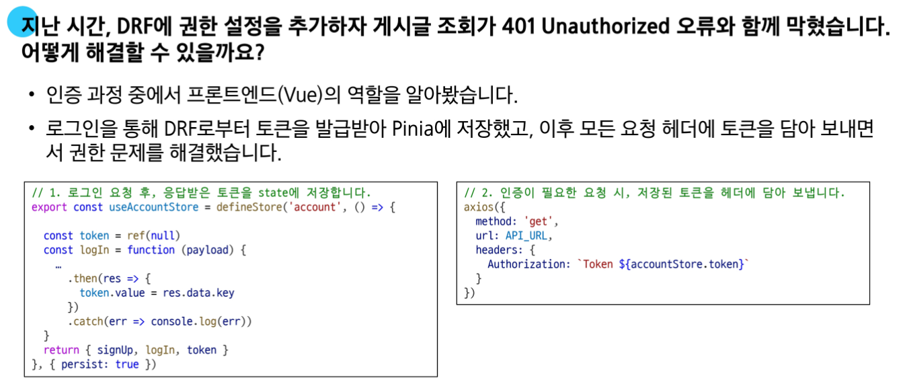