## 251212

### [Build_ 이론]
### JWT
**JSON Web Token**
- 유저가 스스로 누군지 증명하는 디지털 출입증
- 서버가 유저에게 발급해주는 긴 문자열
- 해당 문자열 안에는 유저 정보가 암호화되어 들어있음

**JWT 구조**
- JWT는 '.'(dot)으로 구분하고, 3부분으로 나뉘어져 있음
- Header
    - 어떤 달고리즘으로 암호화했는지 적혀있는 봉투 역할
- Payload
    - 실제 유저 정보가 들어 있는 내용물
    - 누구나 열어볼 수 있어 민감한 정보가 있어서는 안됨
- Signature
    - 정보가 조작되지 않았음을 증명하는 위조 방지 도장
    - 서버가 가진 키로 위조 유무를 확인할 수 있음
    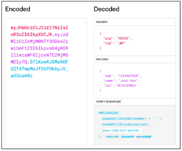

**JWT 동작 흐름**
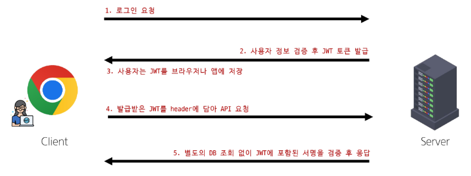

**JWT 특징**
- 장점
    - 서버 부담이 적음
        - DB에 저장하여 누가 로그인 중인지 기억할 필요 없음(Stateless)
    - 확장성이 좋음
        - 서버를 여러 대 늘려도(Scale-out) 토큰만 있으면 어떤 서버에서든 인증이 가능
    - 모바일 친화적
        - 웹 뿐만 아니라 앱에서도 쓰기 편함
- 단점
    - 키를 잃어버렸을 경우 대응하기 어려움
    - 실수로 payload에 개인정보가 있을 시 누구든 확인할 수 있음

**Token 방식 vs. JWT 방식**
- Token 방식
    - 키 자체에는 아무런 정보가 없고 정보는 서버가 가지고 있음
    - DB에 저장된 정보를 확인하여 사용자 인증을 하게 됨
    - 번거롭지만 키 유출 시 서버에서 Disable 처리하여 대응 가능함
    - 로그인 관리가 엄격해야 하는 경우 사용(은행)
- JWT 방식
    - 키에 정보가 들어있어 서버가 정보를 따로 확인할 필요가 없음
    - 서버가 토큰을 해석해서 사용자 인증을 하게 됨
    - 간단하지만 키 유출 시 대응하기 힘듦
    - 대규모 트래픽 처리가 필요한 곳에서 사용(SNS, 쇼핑몰 등)

### JWT 실습
**DRF 공식 문서 확인**
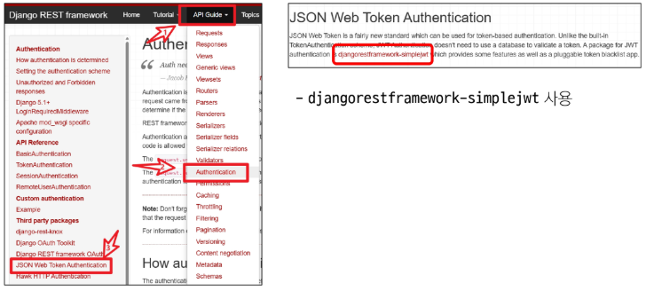

**dj-rest-auth 공시 문서 확인**
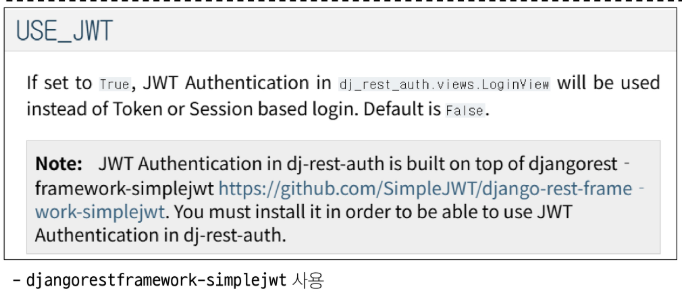

**simple-jwt 설정**
- simple-jwt 패키지 설치
	
	`pip install djangorestframework-simplejwt`
- settings.py 설정

	- 기존 TokenAuthentication을 주석처리 후 JWTAuthentication으로 변경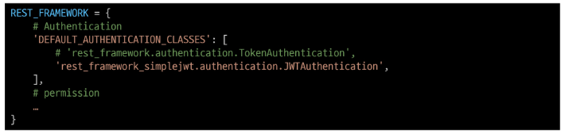
	- INSTALLED_APP에 rest_framework_simplejwt 등록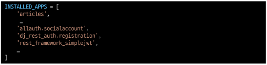
	- dj-rest-auth의 login url을 그대로 활용하기 위해 'USE_JWT'를 True로 설정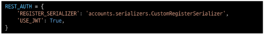

**Vue에서 Login 설정 변경**
- stores/accounts.js에서 logIn 함수 설정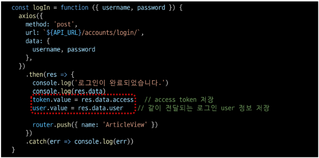

**JWT 응답 확인**
- Login 완료 후 console 창에서 응답 확인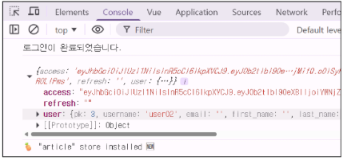

**JWT 정보 확인해보기**
- 전달된 access token을 복사하여 jwt.io에서 내부 확인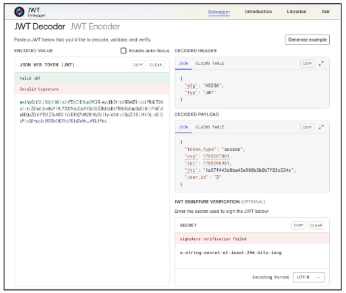
- settings.py 상단에 있는 SECRET_KEY를 붙여 넣으면 인증됨을 확인할 수 있음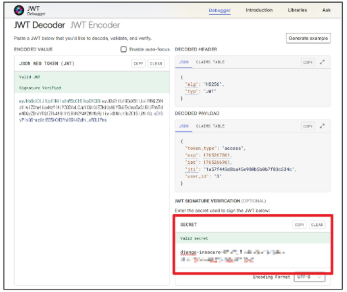

**게시글 조회, 생성 axios 수정**
- Authorization 설정에서 Token이 아닌 Bearer로 변경
	- stores/articles.js 수정 후 정상 동작 확인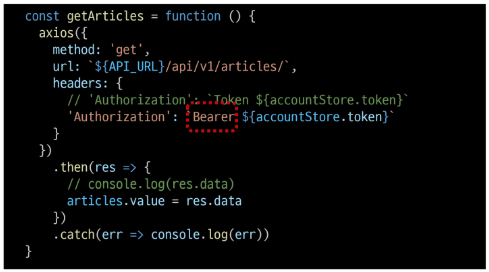
- Authorization 설정에서 Token이 아닌 Bearer로 변경
	- views/CreateView.vue 수정 후 정상 동작 확인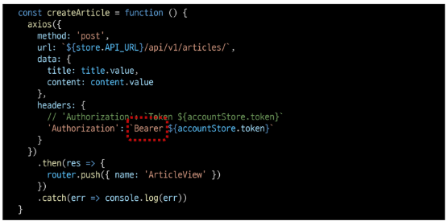